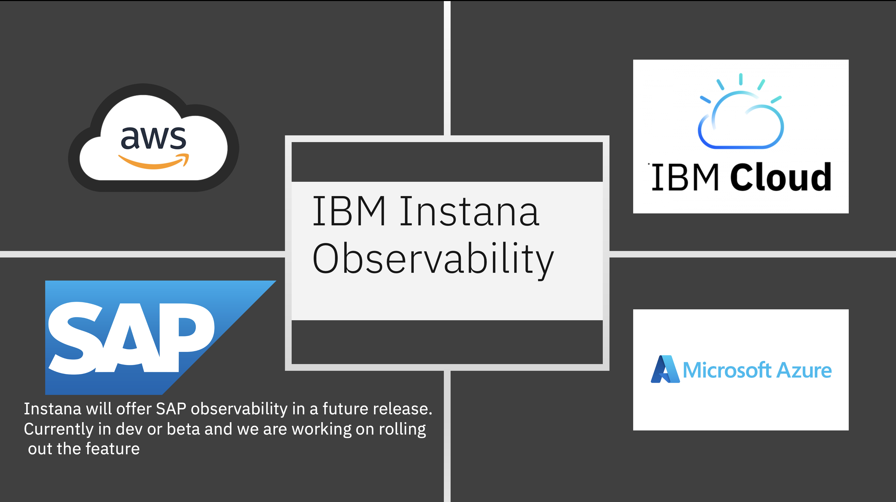
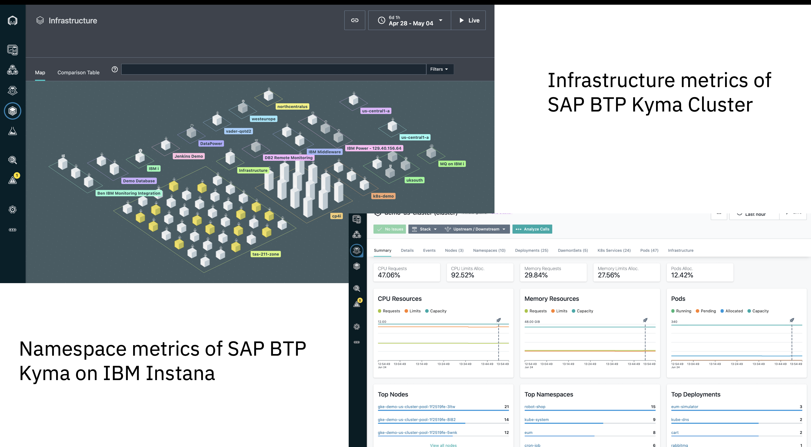

# Unleashing Real-time Insights: Monitoring SAP BTP Cloud-Native Applications with IBM INSTANA 
- By [Ankit Guria](https://w3.ibm.com/#/people/003Z1Y744) Technology Engineer, IBM Ecosystem Engineering, Blue Partners Lab and 
-    [Srikanth Manne](https://w3.ibm.com/#/people/07147P744) Data & AI Architect, IBM Ecosystem Engineering, Blue Partners Lab 

# Introducing the SAP Business Technology Platform:

SAP Business Technology Platform is a technological innovation platform designed for SAP applications that combines data and analytics, AI, application development, automation, and integration into a single, cohesive ecosystem. 

It is capable of data and analytics, integration, automation, and Al, as well as pro-code and low-code application development. It is accessible on well-known public clouds.This comprehensive platform empowers businesses to leverage data-driven insights, enhance user experiences, and seamlessly integrate their systems and processes for digital transformation.

# What is IBM Instana and how is it related to Observability?  

IBM Instana Observability is a powerful and game-changing solution for incident prevention and observability in the dynamic and complex realm of cloud environments. With lightning-fast notifications delivered within a mere three seconds, Instana Observability outshines traditional Application performance Monitoring (APM) tools. But that's not all! This trailblazing solution extends observability to a wide range of people, in roles such as DevOps, SRE, platform engineering, ITOps, and development). Data and application monitoring struggles are resolved, as users can have a great contextual information at their fingertips and effortlessly dive into the insights they need.   
The key elements of Instana are host agents and agent sensors deployed on platforms like IBM Cloud, AWS, Azure, SAP. These components gather, consolidate, and transmit detailed monitoring data to the Instana SaaS backend. 

# Key features of IBM Instana Observability include: 

- Comprehensive Observability.
- Intelligent Automation.
- Swift Remediation and Security.
- Enhanced Performance and User Experience.

You can find out more about the [benefits of IBM Instana here.](https://developer.ibm.com/articles/realtime-monitoring-instana-saas/?mhsrc=ibmsearch_a&mhq=instana) 

# Why SAP BTP + IBM Instana ?

Real-time monitoring is vital for SAP BTP cloud-native applications. IBM Instana ensures proactive issue detection, performance optimization, scalability, efficient incident response, and adherence to security and compliance requirements for SAP BTP cloud-native applications. 

# Supported Cloud Platforms with IBM Instana: 

Regardless of whether you're utilising IBM Cloud, AWS, Azure, SAP, or another cloud platform, IBM Instana supports all major and leading cloud platforms. 

**Note:** Instana will offer SAP Cloud Foundry observability in a future release. Kyma Kubernetes Cluster monitoring already works with the current Instana version. 

# Overview of IBM Instana and its capabilities in SAP BTP environment 

IBM Instana provides real-time monitoring and observability for SAP BTP applications. Its key capabilities include: 
- **Full-Stack Observability**: Monitors the entire SAP BTP stack, including application performance, microservices, databases, and containers. 
- **Auto-Discovery and Dependency Mapping**: Automatically discovers and maps services and their interdependencies. 
- **Real-Time Performance Monitoring**: Monitors key metrics in real time to detect anomalies and optimize performance. 
- **AI-Powered Insights and Root Cause Analysis**: Uses AI to provide intelligent insights and identify root causes of performance issues. 
- **Integration and Extensibility**: Integrates with other monitoring tools and supports a wide range of technologies. 
- **Automation and Remediation**: Offers smart alerts, automatic event correlation, and proactive issue resolution.  

# Exploring the concept of SAP BTP cloud-native applications with Instana 

SAP BTP cloud-native applications, built using cloud-native principles like microservices architecture and DevOps practices, incorporate Java Spring Boot frameworks and utilize HTTP clients for seamless integration with external services. These applications leverage cloud services, container orchestration, and prioritize scalability and resilience. See the below diagram for the reference

The Instana Agent is installed within the SAP BTP account, enabling monitoring of various applications such as node.js, Python, Java Spring Boot, and even the S/4 HANA Cloud Database. Instana effectively monitors these microservices applications, providing visibility into their output and facilitating monitoring through the Instana Dashboard. 

# SAP BTP Kyma

SAP BTP's Kyma runtime is a managed Kubernetes runtime that utilizes the open-source project "Kyma." It allows developers to enhance SAP products by incorporating serverless Functions and seamlessly integrating them with containerized microservices. This cloud-native approach offers several benefits, including improved flexibility, scalability, and cost-effectiveness. Kyma's modular design enables users to select and customize modules based on their specific business needs. Modules can be enabled or disabled as required, giving users control over the infrastructure expenses associated with their chosen modules.

[Kyma](https://help.sap.com/docs/btp/sap-business-technology-platform/kyma-environment) and Docker simplify application deployment. JAR/TAR file is generated after the compilation of the SAP BTP Cloud application. This file is then used to create a Docker image using a Dockerfile. The compiled version of the application is included in the Docker image, which is then pushed to a Kubernetes cluster. Consequently, the BTP application is deployed and operational within the cluster.

**Challenges and risks associated with lack of real-time monitoring and the need:**
Real-time monitoring in SAP BTP lets customers harness the power of proactive detection and transform their operations, eliminating problems related to sluggish performance, downtime, and troubleshooting frustrating errors. Real-time monitoring provides for a much improved user experience, supporting swift action against performance degradation and prompt resolution of issues. Downtime is significantly reduced, and incidents resolved before they even have a chance to grow.
In addition, real-time monitoring adds extra compliance and security, reducing risks  and safeguarding your operations. Resource allocation can now be well orchestrated by optimizing efficiency and eliminating waste.

# IBM Instana for Real-time Monitoring of SAP BTP

**Key features and functionalities of IBM Instana for SAP BTP environment:**

- Real-time Visibility: Instant insights into the performance and health of your SAP BTP applications becomes possible. IBM Instana delivers real-time visibility, ensuring you stay ahead of any performance issues.
- Automated Full-Stack Monitoring: Inefficient, unproductive manual monitoring can be halted. With IBM Instana, you enjoy automated full-stack monitoring, from application performance to infrastructure, microservices, Kubernetes, databases, APIs, and beyond.
- Realize full potential: Cloud native applications can achieve greater benefits as IBM Instana provides you with actionable insights, to optimize performance, enhance the user experience, and drive business success.
- Automation and AI-powered solutions: Utilize automation and AI for issue prediction and resolution, enhancing accuracy and operational efficiency. Also, one can read more about [WatsonX](https://www.ibm.com/watsonx?mhsrc=ibmsearch_a&mhq=watsonx) here.

# Current offerings by SAP BTP vs offerings by IBM Instana

**CPU Utilization:**

Instana enables real-time CPU utilisation monitoring, allowing you to track and optimise the use of processing resources in your application. You can ensure optimal resource allocation and discover any irregularities or spikes that may impair performance by analysing CPU utilisation.

**Memory Utilization:**

By giving you access into memory usage, Instana enables you to keep an eye on how much memory your application is using. You may find memory leaks, improve memory allocation, and avoid out-of-memory issues, which can have an impact on your application's stability and speed, by monitoring memory utilisation.

**SQL Traces:**

SQL tracing is not natively supported by SAP BTP Kyma. It necessitates the use of third-party performance monitoring tools, databases with built-in SQL tracing capabilities, log4j logging frameworks, and so on. However, IBM Instana has solved the bottleneck.

Instana offers SQL traces, which capture and analyze the database queries executed by your application. By examining SQL traces, you can identify slow queries, optimize database interactions, and enhance overall database performance.

We recommend you follow the IBM Instana Documentation to install the Instana Agent to the SAP BTP Kyma Cluster. [Click here](https://www.ibm.com/docs/en/instana-observability/247?topic=openshift-instana-kubectl-plug-in) for the official documentation.  

# Conclusion:

Real-time analytics are provided by IBM's Instana, a crucial technology that enhances the functioning of SAP BTP's cloud-native applications. By utilising strong analytics and AI, Instana enables real-time monitoring, proactive issue diagnosis, and speedy performance optimisation. Businesses can function at their highest levels of efficiency thanks to effective system complexity management. While preserving a superior user experience, Instana quickly locates and eliminates bottlenecks across the application landscape and architecture. And how it can support SAP BTP's traditional monitoring techniques and get rid of all the bottlenecks, including those caused by memory usage, CPU utilisation, SQL tracing, and other issues.

IBM Instana is a comprehensive monitoring solution for SAP BTP's cloud-native applications. 

# About the authors:

: [Ankit Guria](https://w3.ibm.com/#/people/003Z1Y744)
Technology Engineer, Ecosystem Engineering Blue Partner Lab
Ankit Guria is a skilled Software Engineer, Ecosystem Engineering Blue Partners lab at IBM India Software Labs, specializing in JS and frontend technologies, SAP, JAVA, Spring, Kubernetes, IBM Cloud, and Watson & WatsonX technologies, with expertise in JavaScript, Node.js, React, Vue, Angular, HTML, CSS, JSON, and API usage.

: [Srikanth Manne](https://w3.ibm.com/#/people/07147P744)
Data & AI Architect, Ecosystem Engineering Blue Partner Lab
Srikanth Manne is a Data & AI Architect at IBM India Software Labs, driving innovation in the Ecosystem Engineering Blue Partners lab.
He possesses a profound mastery of IBM AI services, Analytics Cognos BI, WatsonX, and Cloud Pak for Data technologies, while showcasing exceptional expertise in the latest AI offerings from IBM.

